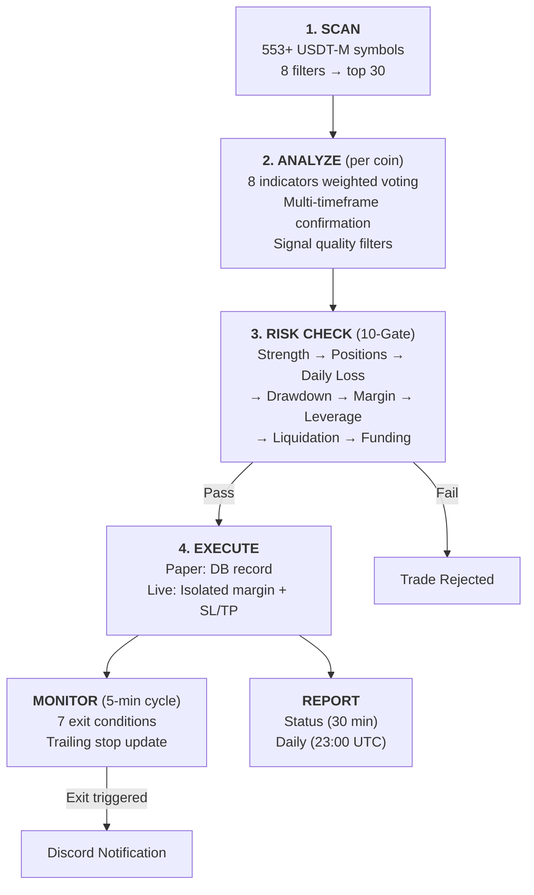
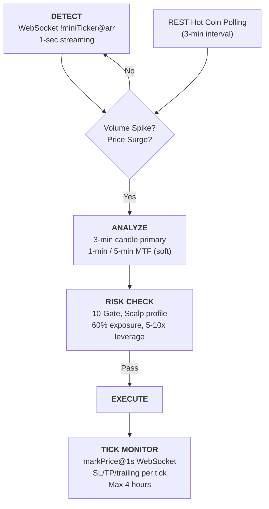

[**한국어**](README.ko.md) | English

# Binance Futures Trading Bot

[](https://opensource.org/licenses/MIT)

Automated Binance USDT-M futures trading bot based on technical analysis

> **Disclaimer**
>
> This software is for **educational and informational purposes only**. It is not financial advice. Use at your own risk. The author is not responsible for any financial losses incurred from using this software. Past performance does not guarantee future results. Always do your own research before trading.

## Overview

A Binance futures automated trading bot that operates purely on technical indicator algorithms without any AI. No separate AI subscription is required. It automates the entire process from coin discovery to signal generation, risk management, order execution, and position monitoring. It can run on a local or cloud server at no additional cost.

## Key Features

- **Technical Analysis**: RSI, MACD, Bollinger Bands, EMA (9/21/200), ATR, ADX, Stochastic — 8-indicator weighted voting + NEUTRAL dead zone filtering + per-profile signal quality filters
- **Bidirectional Trading**: Both LONG and SHORT entries, pursuing profit even in downtrends
- **4 Trading Profiles**: Conservative / Neutral / Aggressive / Scalp — automatic risk and leverage adjustment per trading style
- **Multi-Profile Parallel Execution**: Simultaneous comparison of 3 profiles in Paper mode
- **Event-Driven Scalping**: Real-time WebSocket volume spike / price surge detection → 3-minute candle ultra-short-term trading
- **Dynamic Coin Discovery**: Auto-selects up to 30 candidates from 553+ USDT-M futures symbols every 30 minutes
- **Dynamic Leverage**: Based on volatility tier x signal strength x (1 - drawdown), auto-adjusted 1-10x per profile
- **Fee Modeling**: Round-trip taker fee (0.08%) factored into position sizing
- **10-Gate Risk Management**: Margin-based exposure limits, daily loss caps, drawdown blocking, and more — sequential validation
- **Signal Quality Filters**: MACD opposition / low volume / BB conflict detection → per-profile strength attenuation/rejection
- **ATR-Based Trailing Stop**: Activates after ATR x activation profit reached, locks in profit on ATR x multiplier retracement
- **Per-Position Margin Cap**: Limited to 10-15% of capital, enabling entry on large-cap coins (BTC/ETH)
- **Paper / Live Mode**: Switch between simulated and real trading with a single environment variable
- **Multi-Timeframe**: 1-hour candle primary analysis + 15-minute, 4-hour confirmation (Scalping: 3-minute + 1-minute, 5-minute soft confirmation)
- **7 Auto-Exit Conditions**: Stop loss / take profit / ATR-based trailing stop / signal reversal / liquidation proximity / excessive funding rate / max holding time
- **Discord Notifications**: Trade execution, position closure, status updates, daily reports, multi-profile comparison
- **Isolated Margin**: Per-position margin isolation in live mode (other positions protected if one is liquidated)
- **Network Resilience**: 3x exponential backoff retry + WebSocket auto-reconnect (30-second heartbeat)
- **Docker Deployment**: Deploy swing + scalping as 2 services simultaneously with `docker compose up -d`

## Project Structure

```
binance-futures-bot/
├── config/
│   ├── settings.py              # Global settings (indicators, risk, leverage, schedule)
│   └── profiles.py              # 4 trading profiles (frozen dataclass)
├── data/                        # DB files (gitignored)
├── scripts/
│   ├── scheduler.py             # APScheduler daemon (4 recurring jobs)
│   └── backtest.py              # Backtesting tool
├── src/
│   ├── main.py                  # CLI entry point (futuresbot command)
│   ├── clients/
│   │   ├── binance_rest.py      # ccxt binanceusdm client (3x exponential backoff)
│   │   └── binance_ws.py        # WebSocket real-time stream (auto-reconnect)
│   ├── scanner/
│   │   └── coin_scanner.py      # Volume/volatility-based coin discovery (8 filters)
│   ├── indicators/
│   │   ├── calculator.py        # pandas-ta technical indicator calculation (14 indicators)
│   │   └── signals.py           # 8-indicator weighted voting → trade signal generation
│   ├── strategy/
│   │   ├── analyzer.py          # Per-coin comprehensive analysis + multi-timeframe confirmation
│   │   └── orchestrator.py      # Scan → Analyze → Risk → Execute pipeline
│   ├── risk/
│   │   ├── risk_manager.py      # 10-gate margin-based risk validation
│   │   └── leverage_calc.py     # Dynamic leverage + position sizing (fee modeling)
│   ├── trading/
│   │   ├── paper_trader.py      # Simulated trading (no API calls)
│   │   ├── order_executor.py    # Live order execution (SL/TP registered on exchange, fees deducted)
│   │   └── position_monitor.py  # Swing position monitoring (5-min REST polling, 7 exit conditions)
│   ├── scalping/
│   │   ├── watcher.py           # WebSocket real-time volume spike / price surge detection
│   │   ├── pipeline.py          # Spike → Analyze → Risk → Execute pipeline
│   │   └── monitor.py           # 1-second WebSocket tick monitoring (ultra-short-term exit)
│   ├── db/
│   │   └── models.py            # 8 tables + CRUD (aiosqlite)
│   └── notifications/
│       └── notifier.py          # Discord webhook notifications (2 channels)
├── tests/                       # 169 unit tests (12 files)
├── Dockerfile
├── docker-compose.yml           # 2 services (bot + scalp)
├── pyproject.toml
└── .env.example
```

## Quick Start

### Requirements

- Python 3.11+
- Binance API key (read permission required; futures trading permission needed for live mode)
- Discord webhook URL (optional)

### Installation

```bash
git clone https://github.com/alton15/binance-futures-bot.git
cd binance-futures-bot

# Set up virtual environment
python -m venv .venv
source .venv/bin/activate
pip install -e .

# Configure environment variables
cp .env.example .env
# Enter your API keys in the .env file
```

### Environment Variables (.env)

```env
# Binance API
BINANCE_API_KEY=your_api_key_here
BINANCE_API_SECRET=your_api_secret_here
BINANCE_TESTNET=false             # true: testnet, false: mainnet

# Trading Mode
TRADING_MODE=paper                # paper: simulated trading, live: real trading

# Initial Capital (USDT)
INITIAL_CAPITAL=100

# Discord Notifications (optional)
DISCORD_WEBHOOK_ALERTS=           # Trade execution/closure alerts
DISCORD_WEBHOOK_REPORTS=          # Status updates + daily reports
```

### CLI Commands

```bash
# Swing Trading
futuresbot run --paper              # Paper mode single run (neutral profile)
futuresbot run --paper --dry-run    # Scan/analyze only (no trades)
futuresbot run --paper --loop       # Start scheduler daemon (30-min cycle)
futuresbot run --live               # Live mode execution

# Profile Selection
futuresbot run --paper --profile conservative   # Conservative
futuresbot run --paper --profile aggressive     # Aggressive
futuresbot run --paper --multi                  # 3 profiles in parallel

# Event-Driven Scalping
futuresbot run --scalp --paper      # Start WebSocket-based scalping

# Individual Features
futuresbot scan                     # Run coin scan only
futuresbot scan --limit 30          # Top 30 candidates
futuresbot analyze BTCUSDT          # Analyze specific symbol
futuresbot status                   # Check bot status
futuresbot status --profile scalp   # Status for specific profile
futuresbot positions                # Open position details
futuresbot history                  # Recent trade history (20 entries)
futuresbot history --limit 50       # Recent 50 entries

# Backtesting
futuresbot backtest BTCUSDT
futuresbot backtest ETHUSDT --from 2024-01-01 --to 2024-02-01
```

### Background Execution (macOS)

```bash
# Prevent sleep + run bot
caffeinate -i futuresbot run --paper --loop
```

## Core Architecture

### Swing Trading Pipeline (30-Minute Cycle)



### Event-Driven Scalping Pipeline



### Trade Signal Generation (8-Indicator Weighted Voting)

Eight technical indicators each vote LONG/SHORT/NEUTRAL, and a weighted composite score determines direction and strength.

| Indicator | Weight | LONG Condition | SHORT Condition | NEUTRAL Condition |
|-----------|:------:|----------------|-----------------|-------------------|
| MACD (12/26/9) | 2.0 | Bullish crossover, expanding positive histogram, above signal line | Bearish crossover, expanding negative histogram, below signal line | Histogram sign disagrees with position |
| RSI (14) | 1.5 | Oversold (< 30), below 40 | Overbought (> 70), above 60 | 40-60 range |
| EMA 200 Trend | 1.5 | Price > 200 EMA (+1% or more) | Price < 200 EMA (-1% or more) | Within ±1% of 200 EMA |
| Bollinger Bands (20, 2σ) | 1.0 | Below 20% of band | Above 80% of band | 20-80% of band |
| EMA Cross (9/21) | 1.0 | Golden cross or spread ≥0.3% | Death cross or spread ≥0.3% | EMA convergence (spread <0.3%) |
| Stochastic (14, 3) | 1.0 | K < 20 oversold or cross up | K > 80 overbought or cross down | K 20-80 range |
| Volume (SMA 20) | 1.0 | Above-avg volume + above 200 EMA | Above-avg volume + below 200 EMA | Below-avg volume |
| ADX (14) | 1.0 | ADX ≥ 15 + uptrend | ADX ≥ 15 + downtrend | ADX < 15 (weak trend) |

**Signal Decision**:
```
long_score > short_score → LONG
short_score > long_score → SHORT
Tie → NEUTRAL (no entry)
Strength = winning side score / total weight sum (total weight 10.0)
```

**Pass Criteria**: Confirming indicators ≥ 4 (Conservative: ≥4, Aggressive: ≥5, Scalp: ≥3) AND strength ≥ profile minimum (MTF is soft for all profiles — strength penalty only, no hard gate)

**Signal Quality Filters** (per-profile penalties):

| Filter | Conservative | Neutral | Aggressive | Scalp |
|--------|:-----------:|:-------:|:----------:|:-----:|
| MACD opposing direction | Reject (×1.0) | -30% | -30% | -20% |
| Low volume (below avg) | Reject (0.5x) | -15% (0.5x) | None | None |
| BB direction conflict | -20% | -10% | None | None |

- **Reject**: Signal immediately rejected when penalty is 1.0 or volume below threshold
- **-N%**: Strength attenuated by N%, then re-checked against minimum strength threshold

**Multi-Timeframe Adjustment** (soft penalty for all profiles):
- Both 15-min + 4-hour confirm same direction → strength × 1.15
- Only one confirms same direction → no adjustment (default)
- Both oppose direction → strength × 0.5 (no hard block — reduced strength may still pass if above minimum)

### 10-Gate Risk Management

All trade signals must pass through 10 sequential risk gates to be executed. If any gate fails, the trade is immediately rejected. Each gate's thresholds vary by profile.

| Gate | Validation | Conservative | Neutral | Aggressive | Scalp |
|:----:|-----------|:-----------:|:-------:|:----------:|:-----:|
| 1 | Signal strength | ≥ 0.65 | ≥ 0.65 | ≥ 0.65 | ≥ 0.45 |
| 2 | Open position count | ≤ 3 | ≤ 5 | ≤ 5 | ≤ 3 |
| 3 | Duplicate symbol | None | None | None | None |
| 4 | Daily loss | ≤ 4% | ≤ 6% | ≤ 8% | ≤ 7% |
| 5 | Max drawdown | ≤ 10% | ≤ 20% | ≤ 25% | ≤ 20% |
| 6 | Available margin | ≥ required margin | 〃 | 〃 | 〃 |
| 7 | Total margin exposure | ≤ 40% | ≤ 60% | ≤ 70% | ≤ 60% |
| 8 | Leverage | 1-3x | 2-6x | 3-8x | 5-10x |
| 9 | Liquidation buffer | ≥ 30% | ≥ 20% | ≥ 15% | ≥ 15% |
| 10 | Funding rate | ≤ 0.1% | ≤ 0.1% | ≤ 0.1% | ≤ 0.1% |

Gate 4 daily loss is calculated against **dynamic capital** (initial capital + today's profits), supporting compound growth.

### Dynamic Leverage

Maximum leverage is capped based on volatility, and the final leverage is determined by factoring in signal strength and drawdown. Each profile has different volatility tiers and leverage ranges.

**Neutral Profile Volatility Tiers (default)**:

| Daily Volatility | Max Leverage |
|:----------------:|:------------:|
| 0-2% | 6x |
| 2-4% | 4x |
| 4-6% | 3x |
| 6%+ | 2x |

**Leverage Range by Profile**:

| Profile | Min | Max | Low Volatility Tier | High Volatility Tier |
|---------|:---:|:---:|:-------------------:|:--------------------:|
| Conservative | 1x | 3x | 3x | 1x |
| Neutral | 2x | 6x | 6x | 2x |
| Aggressive | 3x | 8x | 8x | 3x |
| Scalp | 5x | 10x | 10x | 5x |

**Formula**: `Final leverage = tier max × signal strength × (1 - drawdown rate)` → clamped to [min, max] range

### Position Sizing

Fixed-fraction risk model + fee modeling + margin cap:

```
Risk amount    = capital × risk_per_trade_pct
Fees           = taker round-trip (0.04% × 2 = 0.08%)
SL distance    = ATR × sl_atr_multiplier
TP distance    = ATR × tp_atr_multiplier   (R:R = 1:2, default 2.0/4.0)
Position size  = risk amount / (SL distance + fees)
Notional       = position size × entry price
Margin         = notional / leverage
Margin cap     = capital × 15%  (position size reduced if exceeded)
```

The margin cap enables entry on large-cap coins like BTC and ETH even with small capital.

### Position Monitoring (7 Auto-Exit Conditions)

**Swing**: Scheduler checks all open positions via REST API every 5 minutes.
**Scalping**: markPrice@1s WebSocket checks every second.

| Condition | Threshold | Description |
|-----------|:---------:|-------------|
| Stop Loss (SL) | ATR × SL multiplier | Immediate exit when price hits SL |
| Take Profit (TP) | ATR × TP multiplier | Immediate exit when price hits TP |
| Trailing Stop | ATR-based dynamic | Activates after ATR × activation profit, locks profit on ATR × multiplier retracement |
| Signal Reversal | Opposing signal | Exit when opposite direction signal detected |
| Liquidation Proximity | Within 30% | Preemptive exit when buffer to liquidation price is insufficient |
| Excessive Funding Rate | Above 0.2% | Exit when funding rate is unfavorable for the position |
| Max Holding Time | Per profile | Conservative 48h, Neutral/Aggressive 72h, Scalp 4h |

**Paper vs Live Exit Methods**:
- Paper: Compares current price against SL/TP prices stored in DB
- Live: SL/TP orders are actually registered on the exchange (exchange executes even if bot is down) + monitor additionally checks trailing/funding/time

## 4 Trading Profiles

Defined as frozen dataclasses in `config/profiles.py`. Each profile has different risk, leverage, entry conditions, and holding times.

### Profile Comparison (based on $100)

| Parameter | Conservative | Neutral | Aggressive | Scalp |
|-----------|:-----------:|:-------:|:----------:|:-----:|
| Risk per trade | 1.5% ($1.5) | 2% ($2) | 2% ($2) | 0.8% ($0.8) |
| Concurrent positions | 3 | 5 | 5 | 3 |
| Total margin exposure | 40% | 60% | 70% | 60% |
| Daily loss limit | 4% ($4) | 6% ($6) | 8% ($8) | 7% ($7) |
| Max drawdown | 10% | 20% | 25% | 20% |
| Leverage range | 1-3x | 2-6x | 3-8x | 5-10x |
| Min signal strength | 0.65 | 0.65 | 0.65 | 0.45 |
| SL multiplier (ATR) | 2.0 | 2.0 | 2.0 | 3.0 |
| TP multiplier (ATR) | 4.0 | 4.0 | 4.0 | 3.5 |
| Trailing stop | 3.0% | 3.0% | 3.5% | 2.0% |
| Trailing activation | 1.5x ATR | 1.2x ATR | 1.2x ATR | 1.2x ATR |
| Liquidation buffer | 30% | 20% | 15% | 15% |
| Max holding time | 48 hours | 72 hours | 72 hours | 4 hours |
| Analysis timeframe | 1h + 15m/4h (soft MTF) | 1h + 15m/4h (soft MTF) | 1h + 15m/4h (soft MTF) | 3m + 1m/5m (soft MTF) |

### Multi-Profile Mode

```bash
futuresbot run --paper --multi    # Run conservative + neutral + aggressive simultaneously
```

- Paper mode: 3 profiles run in parallel, each with independent positions/statistics
- Live mode: Only single profile allowed for safety
- Per-profile P&L comparison reports automatically sent to Discord

## Scheduler Behavior

### Swing Mode (`futuresbot run --paper --loop`)

| Task | Interval | Description |
|------|:--------:|-------------|
| Coin scan + trading | 30 min | Full pipeline execution |
| Position monitoring | 5 min | 7 exit condition checks (REST polling) |
| Discord status update | 30 min | Wallet, Available, margin, P&L report |
| Daily report | Daily 23:00 UTC | Comprehensive P&L + risk + recent trades |

### Scalping Mode (`futuresbot run --scalp --paper`)

| Task | Interval | Description |
|------|:--------:|-------------|
| Spike detection | Real-time (WebSocket) | Volume spike, price surge events |
| Hot coin polling | 3 min | Top movers / volume via REST API |
| Position monitoring | Real-time (1s tick) | markPrice@1s WebSocket subscription |
| Discord status update | 30 min | Scalping-specific status report |
| Daily report | Daily 23:00 UTC | Scalping P&L summary |

## Discord Notifications

Split into 2 webhook channels:

### #alerts Channel (`DISCORD_WEBHOOK_ALERTS`)

- **Trade Execution**: Symbol, direction (LONG/SHORT), leverage, entry price, size, SL/TP
- **Position Closure**: Symbol, direction, P&L, exit reason (WIN/LOSS indicator)

### #reports Channel (`DISCORD_WEBHOOK_REPORTS`)

- **Status Update (30 min)**: Wallet (total assets), Available (free cash), margin usage, realized/unrealized P&L, win rate, open position list
- **Multi-Profile Comparison**: Per-profile Wallet, P&L, win rate, trade count comparison table + ranking
- **Daily Report (23:00 UTC)**: 4 embeds
  1. Overview — Capital, total P&L, today's P&L, win rate bar
  2. P&L Breakdown — Total profit/loss, best/worst trade, funding fees
  3. Risk — Daily loss limit utilization, margin/exposure status
  4. Recent Trades — Recent trade list + P&L

## DB Schema (8 Tables)

| Table | Purpose |
|-------|---------|
| `coins` | Scanned coin metadata (volume, volatility, score) |
| `signals` | Generated trade signals (direction, strength, indicator details) |
| `trades` | Order execution records (entry price, leverage, margin) |
| `positions` | Position state (SL/TP, liquidation price, unrealized P&L, trailing) |
| `orders` | SL/TP order management (includes exchange order IDs) |
| `pnl_snapshots` | Daily P&L snapshots (peak capital, drawdown tracking) |
| `funding_payments` | Funding fee collection/payment records |
| `indicator_snapshots` | Technical indicator history (for analysis) |

Supports per-profile queries (filtered by paper/live + profile name).

## Docker Deployment

```bash
git clone https://github.com/alton15/binance-futures-bot.git
cd binance-futures-bot
cp .env.example .env   # Configure API keys
docker compose up -d   # Start both services
docker compose logs -f # View logs
docker compose down    # Stop
docker compose restart # Restart
```

**2 Services**:
- `bot`: Swing trading daemon (30-min scan cycle)
- `scalp`: WebSocket event-driven scalping (separate process)

`restart: unless-stopped` for automatic restart on crash. `./data:/app/data` volume for DB persistence. 60-second health check interval.

## Cloud Deployment (Oracle Cloud)

Run for free permanently with Oracle Cloud Always Free tier:

| Resource | Free Spec |
|----------|-----------|
| CPU | ARM 4 cores |
| RAM | 24GB |
| Storage | 200GB |
| Network | 10TB/month |

Shape: `VM.Standard.A1.Flex` (ARM), Image: Ubuntu 22.04

## Testing

```bash
# All tests (169)
pytest tests/ -v

# Individual modules
pytest tests/test_db_models.py -v           # DB models (11)
pytest tests/test_indicators.py -v          # Technical indicators (5)
pytest tests/test_signals.py -v             # Signal generation + NEUTRAL dead zone (13)
pytest tests/test_signal_quality.py -v      # Signal quality filters (16)
pytest tests/test_coin_scanner.py -v        # Coin scanner (4)
pytest tests/test_leverage_calc.py -v       # Leverage + fee modeling (30)
pytest tests/test_risk_manager.py -v        # 10-gate risk (14)
pytest tests/test_profiles.py -v            # Profile immutability + fallback (16)
pytest tests/test_notifier.py -v            # Notification formatting (7)
pytest tests/test_order_executor.py -v      # Order execution + fees (3)
pytest tests/test_position_monitor.py -v    # Trailing stop + exit (13)
pytest tests/test_scalping.py -v            # Scalping full suite (37)
```

## Tech Stack

| Category | Technology | Purpose |
|----------|-----------|---------|
| Language | Python 3.11+ | Full async/await |
| Exchange API | ccxt (binanceusdm) | Binance USDT-M futures only |
| Technical Indicators | pandas-ta | RSI, MACD, BB, etc. (pure Python) |
| Data Processing | pandas, numpy | OHLCV data manipulation |
| Database | aiosqlite | Async SQLite |
| Scheduler | APScheduler | Periodic job execution |
| Real-time Stream | websockets | Mark price, mini ticker, book ticker |
| HTTP Client | httpx | Discord webhook delivery |
| Environment Variables | python-dotenv | .env file management |
| Container | Docker | 2-service deployment (bot + scalp) |

## Operating Costs

| Item | Cost |
|------|:----:|
| Binance API (market data) | Free |
| pandas-ta indicator calculation | Free |
| SQLite DB | Free |
| Discord webhooks | Free |
| Oracle Cloud server | Free (Always Free) |
| **Live trading fees** | **0.02-0.04%/trade** |
